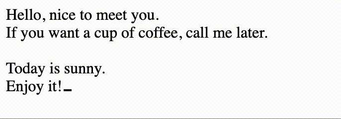

# TEXT TRAVELER

A library to traverse a string, which make it like a traveling.
String paragraphs will be read by given time/duration one by one.

## travelText

```js
const traveler = travelText`
  I am Frustigor.${[100,1000,1,200]}
  If you want a cup of coffee,${[100,500]} call me later.${[100, 200]}

  Today is sunny.${[100, 100]}
  Enjoy it!${[100, 2000]}
`
travel.on('type', (text) => console.log(text))
travel.on('delete', (text) => console.log(text))
```

As you see, put `${[100,1000,1,200]}` where you want to break paragraphs.
You should pass an array in the placeholder expressions.
The 4 value stand for:

- typing speed for each letter
- wait time after typed letters
- whether to delete the letters which typed in previously
- interlude time before next paragraphs

Use `on` to listen what happend when travel, and do something this these callback functions.
TextTravler do not care what to do for your UI, it just travel the text. You should change your UI in `on` callbacks, or you can use `createTextWriter`.

## createTextWriter

A travel-writer function will be create by using this function.

```js
const write = createTextWriter(document.querySelector('#book'), false)
```

Params:

- el: which DOM node to write text
- loop: whether to rewrite after all text finish

```js
write`
  I am Frustigor.${[100,1000,1,200]}
  If you want a cup of coffee,${[100,500]} call me later.${[100, 200]}

  Today is sunny.${[100, 100]}
  Enjoy it!${[100, 2000]}
`
```


